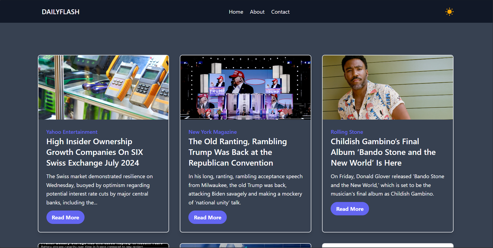
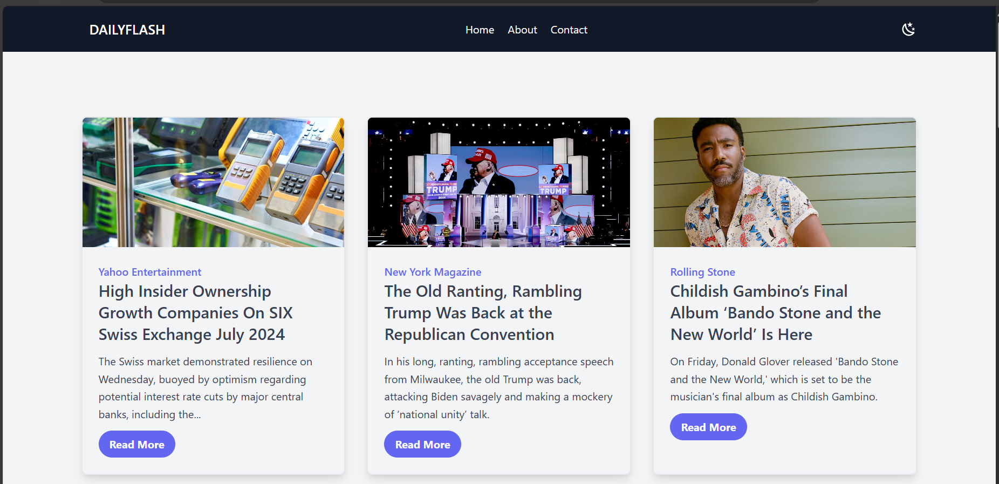

  <h1>DailyFlash</h1>
  
  

    DailyFlash a website that offers daily news updates using the Google News API.
  

  
 

<!-- Table of Contents -->
# Table of Contents

- [About the Project](#about-the-project)
  * [Screenshots](#screenshots)
  * [Tech Stack](#tech-stack)
- [License](#license)
- [Contact](#contact)
- [Acknowledgements](#acknowledgements)
  

<!-- About the Project -->
## About the Project

DailyFlash is a website that offers daily news updates using the Google News API. For front-end development, I used HTML, CSS, Tailwind CSS, and JavaScript. I created a simple, intuitive UI to improve the user experience.

<!-- Screenshots -->
### Screenshots

 
  
  

<!-- TechStack -->
### Tech Stack

  <ul>
    <li><a href="https://developer.mozilla.org/en-US/docs/Web/HTML">HTML</a></li>
    <li><a href="https://developer.mozilla.org/en-US/docs/Web/CSS">CSS</a></li>
    <li><a href="https://developer.mozilla.org/en-US/docs/Web/JavaScript">JavaScript</a></li>
    <li><a href="https://tailwindcss.com/">TailwindCSS</a></li>
    <li><a href="https://developers.google.com/news">Google News API</a></li>
  </ul>

<!-- License -->
## License

This project is licensed under the MIT License - see the [LICENSE](LICENSE) file for details.

<!-- Contact -->
## Contact

Karan Khatri - [LinkedIn](https://www.linkedin.com/in/karan-r-khatri/)

Project Link: [https://github.com/Karan6354/DailyFlash](https://github.com/Karan6354/DailyFlash)

<!-- Acknowledgments -->
## Acknowledgements

We would like to thank the following resources that have made this project possible:

- **[News API](https://newsapi.org/)**: This API provided the news data and content aggregation used in our application. Its reliable and comprehensive data access has been invaluable for the project's development.

- **[TailwindCSS](https://tailwindcss.com/)**: TailwindCSS made it easy to style and design our application with its utility-first CSS framework. Its responsive and customizable design components greatly improved our development workflow and the overall look and feel of the application.

We are grateful for these tools and the developers behind them for their contributions to the open-source community.
